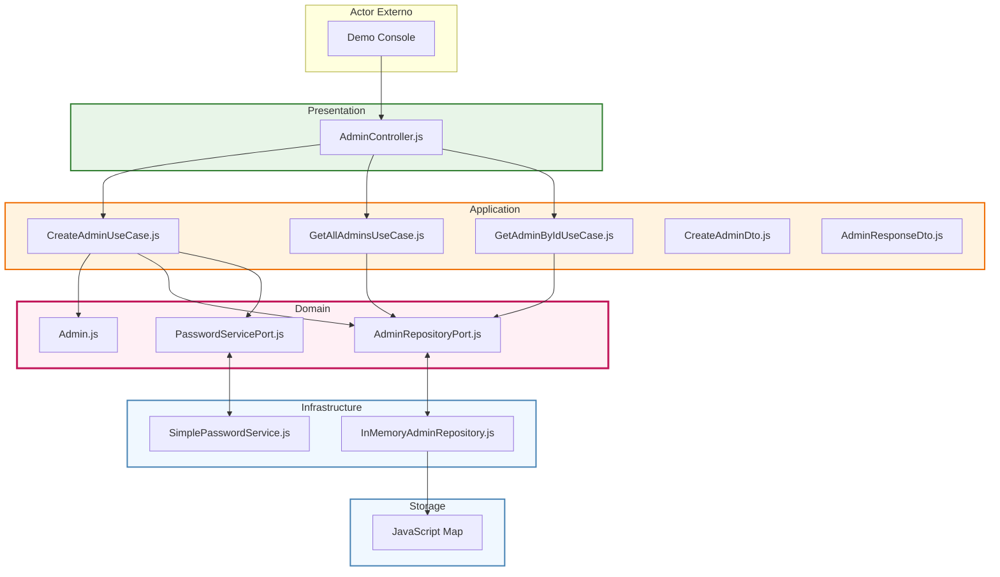

# Diagrama: Arquitectura Hexagonal Implementada (ejemplos/hexagonal)

Diagrama simplificado que muestra exactamente lo que está implementado en `ejemplos/hexagonal/` - solo Admin entity y sus casos de uso básicos.

## Implementación Real del Ejemplo:

### 🎯 **Lo que está implementado:**
- **1 Entity**: Solo `Admin` con validaciones básicas
- **3 Use Cases**: Create, GetAll, GetById
- **2 Ports**: Repository y PasswordService  
- **2 Adapters**: InMemory repository y simple password hash
- **2 DTOs**: Input y output para API

### 🔧 **Casos de uso reales:**
1. **CreateAdmin**: Email único + hash password + save
2. **GetAllAdmins**: Lista todos los admins (sin filtros)
3. **GetAdminById**: Busca por ID específico

### � **Storage real:**
- JavaScript `Map` en memoria
- Hash simple (no bcrypt real)
- Sin persistencia real

### ✅ **Principios hexagonales aplicados:**
- Ports definen contratos
- Domain no conoce infrastructure  
- Fácil intercambiar adapters
- Testing con mocks simple
