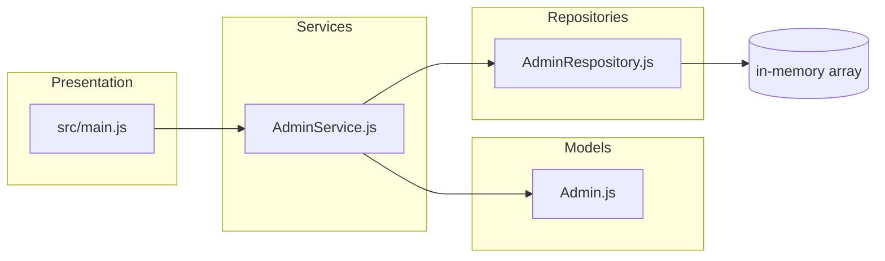

# Diagrama: Arquitectura Modular (semana2/ejemplos/modular)

Breve: muestra las capas separadas (models, services, repositories) y dependencias directas en el ejemplo `modular`.

Puntos clave:
- Mejor organización que el monolito
- Aún hay acoplamiento a implementaciones concretas
- Más fácil de testear que el monolito
