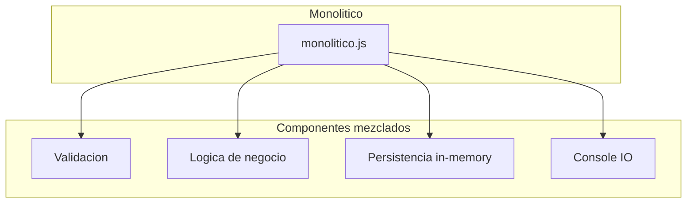

# Diagrama: Arquitectura Monolítica (semana2/ejemplos/monolitico)

Breve: muestra cómo en el ejemplo `monolitico` todo está en un único archivo y las capas se mezclan.

Puntos clave:
- Todo en `monolitico.js`.
- No hay contratos ni separación clara.
- Útil solo para prototipos.
