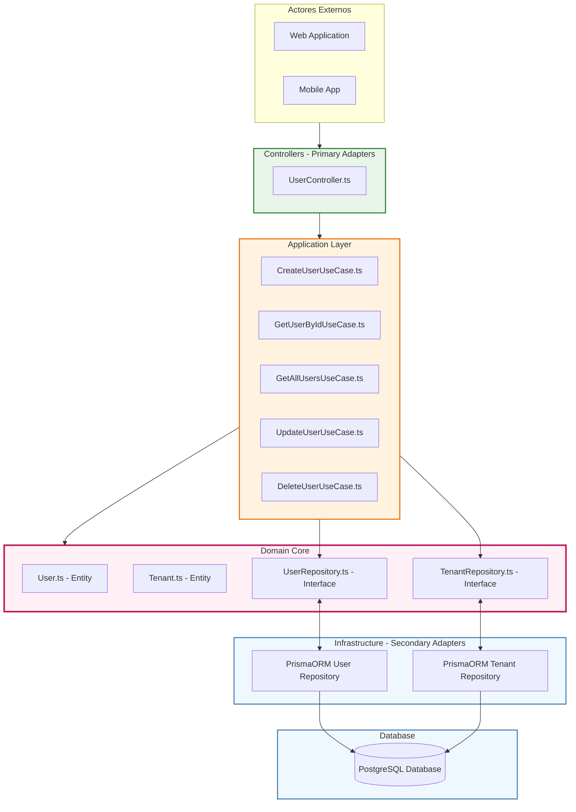

# Diagrama: Arquitectura Hexagonal SmartParkingTwo - User Domain

Diagrama simplificado que muestra la implementación hexagonal real en SmartParkingTwo enfocada en User domain, sin complejidades adicionales de multitenancy.



## Implementación Real en SmartParkingTwo:

### 🎯 **Entidades Implementadas:**
- **User.ts**: Entity con validaciones (email, name, tenantId)
- **Tenant.ts**: Entity para organizaciones

### 🔧 **Use Cases Implementados:**
1. **CreateUserUseCase**: Crear usuario con validaciones
2. **GetUserByIdUseCase**: Buscar usuario por ID
3. **GetAllUsersUseCase**: Listar todos los usuarios  
4. **UpdateUserUseCase**: Actualizar datos de usuario
5. **DeleteUserUseCase**: Eliminar usuario

### 🔌 **Puertos (Interfaces):**
- **UserRepository.ts**: Interface para operaciones de User
- **TenantRepository.ts**: Interface para operaciones de Tenant

### 🛠️ **Adaptadores (Infrastructure):**
- **Prisma  ORM Repositories**: Implementaciones concretas usando Prisma
- **PostgreSQL**: Base de datos real

### ✅ **Principios Hexagonales Aplicados:**
- **Dependency Inversion**: Use cases dependen de interfaces, no implementaciones
- **Port & Adapters**: Interfaces claras entre capas
- **Domain Independence**: Entities sin conocimiento de framework
- **Infrastructure Isolation**: Database details en infrastructure layer

### � **Operaciones User Reales:**
```typescript
// UserRepository interface methods:
- create(user: User): Promise<User>
- findById(id: string): Promise<User | null>  
- findAll(): Promise<User[]>
- findByEmail(email: string): Promise<User | null>
- update(id: string, data: Partial<User>): Promise<User | null>
- delete(id: string): Promise<boolean>
```

### �️ **Domain Rules Implementadas:**
- Email format validation
- Name length validation  
- TenantId UUID validation
- User belongs to tenant verification
