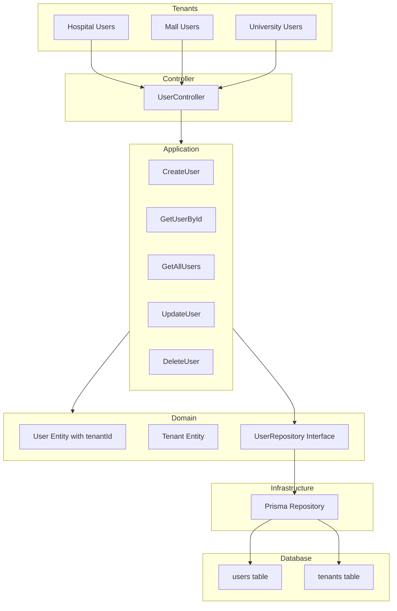

# Diagrama: Multitenancy Implementado en SmartParkingTwo - User Domain

Diagrama que muestra la implementación real de multitenancy en SmartParkingTwo para User domain, basado en el código actual del proyecto.



## Implementación Real de Multitenancy:

### 🏗️ **User Entity con tenantId:**
```typescript
class User {
    constructor(
        readonly id: string,
        readonly tenantId: string, // ← Campo tenantId integrado
        readonly email: string,
        readonly name: string,
        // ... otros campos
    )
    
    belongsToTenant(tenantUuid: string): boolean {
        return this.tenantId === tenantUuid;
    }
}
```

### 🔧 **Repository con Filtrado por Tenant:**
```typescript
interface UserRepository {
    findAll(tenantId: string): Promise<User[]>           // ← Filtrado por tenant
    findById(id: string, tenantId: string): Promise<User | null>  // ← Con tenant check
    findByEmail(email: string, tenantId: string): Promise<User | null> // ← Email único por tenant
    update(id: string, tenantId: string, data: Partial<User>): Promise<User | null>
    delete(id: string, tenantId: string): Promise<boolean>
    countByTenant(tenantId: string): Promise<number>     // ← Conteo por tenant
}
```

### 🗃️ **Estrategia de Aislamiento:**
- **Shared Database**: Una sola base de datos PostgreSQL
- **Tenant Column**: Campo `tenant_id` en tabla `users`
- **Query Filtering**: Todos los queries incluyen filtro por `tenantId`
- **Data Isolation**: Los usuarios solo ven datos de su tenant

### � **Validaciones Implementadas:**
- **tenantId Validation**: UUID format validation en User entity
- **Email Uniqueness**: Por tenant (no globalmente)
- **Tenant Access**: `belongsToTenant()` method para verificaciones
- **Cross-tenant Prevention**: Repository methods requieren tenantId

### 🎯 **Flujo Real:**
1. Request llega con contexto de tenant (Hospital/Mall/Universidad)  
2. Controller extrae tenant information del request
3. Use Cases reciben tenantId como parámetro
4. Repository filtra automáticamente por tenantId
5. Solo datos del tenant específico son retornados

### ✅ **Beneficios de esta Implementación:**
- **Simple pero Efectiva**: Shared schema con tenant isolation
- **Performance**: Single database, efficient queries
- **Security**: Automatic tenant filtering en todas las operaciones
- **Scalable**: Fácil agregar nuevos tenants sin changes estructurales
