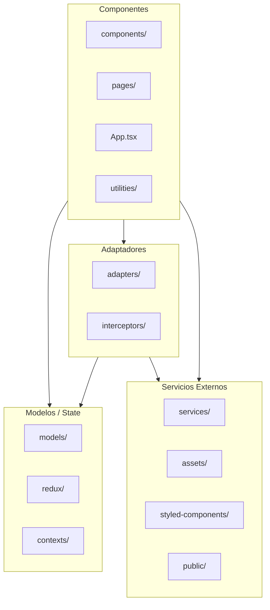

# Diagrama: Clean Architecture - Frontend SmartParkingTwo

```mermaid
flowchart TB
  %% Modelos y State
  subgraph MODELOS_STATE["Modelos / State"]
    Models[models/]
    Redux[redux/]
    Contexts[contexts/]
  end

  %% Componentes
  subgraph COMPONENTES["Componentes"]
    Components[components/]
    Pages[pages/]
    App[App.tsx]
    Utilities[utilities/]
  end

  %% Adaptadores
  subgraph ADAPTADORES["Adaptadores"]
    Adapters[adapters/]
    Interceptors[interceptors/]
  end

  %% Servicios Externos
  subgraph SERVICIOS_EXTERNOS["Servicios Externos"]
    Services[services/]
    Assets[assets/]
    Styled[styled-components/]
    Public[public/]
  end

  %% Relaciones
  COMPONENTES --> MODELOS_STATE
  COMPONENTES --> ADAPTADORES
  ADAPTADORES --> MODELOS_STATE
  COMPONENTES --> SERVICIOS_EXTERNOS
  ADAPTADORES --> SERVICIOS_EXTERNOS
```